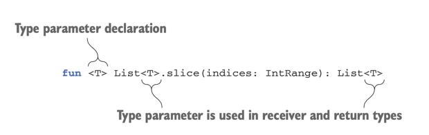
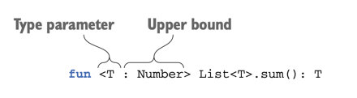
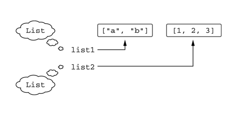
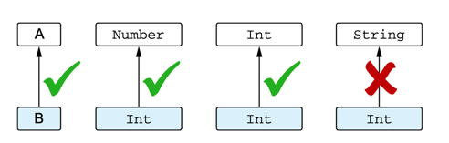
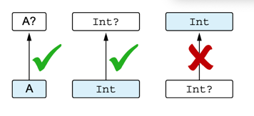
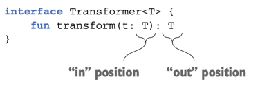
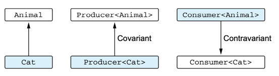

# 제네릭스
- 자바와 유사
- 실체화된 타입 파라미터 : 인라인 함수 호출에서 타입 인자로 쓰인 구체적인 타입을 실행 시점에 알 수 있다.
- 선언 지점 변성 : 기저 타입은 같지만 타입 인자가 다른 상위/하위 타입 관계에 따라 두 제너릭 테입의 상위/하위 타입 관계가 어떻게 되는지 지정
- 사용 지점 변성 : 제네릭 타입 값을 사용하는 위치에서 파라미터 타입에 대한 제약 표시, 자바의 와일드 카드가 그 예시

## 제네릭 타입 파라미터

- 제네릭스를 사용하면 타입 파라미터를 받는 타입을 정의할 수 있다.
- 제네릭 타입의 인스턴스를 만들려면 타입 파라미터를 구체적인 타입 인자로 치환해야 한다.

### 제네릭 함수와 프로퍼티

- 제네릭 함수를 호출할 때는 함수 이름 뒤에 꺽쇠 괄호를 붙이고 그 안에 타입 인자를 지정한다.
- 타입 인자를 명시하지 않으면 컴파일러가 타입 인자를 추론한다.

~~~
>>> val letters = ('a'..'z').toList()
>>> println(letters.slice<Char>(0..2))
[a, b, c]
>>> println(letters.slice(10..13))
[k, l, m, n]
~~~

제너릭 고차 함수 호출하기

~~~ kotlin
val authors = listOf("Dmitry", "Svetlana")
val readers: MutableList<String> = mutableListOf()
fun <T> List<T>.filter(predicate: (T) -> Boolean): List<T>
>>> readers.filter { it !in authors }
~~~

> 확장 프로퍼티만 제네릭하게 만들 수 있다.

### 제네릭 클래스 선언

- 자바와 동일하게 코틀린에서도 타입 파라미터를 넣은 꺾쇠 기호(<>)를 클래스 이름 뒤에 붙이면 클래스(인터페이스)를 제네릭하게 만들 수 있다.
- 타입 파라미터를 이름 뒤에 붙이고 나면 클래스 본문 안에서 타입 파라미터를 일반 타입처럼 사용할 수 있다.

~~~ kotlin
interface List<T> {
    operator fun get(index: Int): T
}
~~~

### 타입 파라미터 제약

클래스나 함수에 사용할 수 있는 타입 인자를 제한하는 기능

- 타입 파라미터에 대한 상한을 지정하면 그 타입 파라미터를 구체적으로 지정하는 타입 인자는 반드시 그 상한 타입이거나 그 상한 타입의 하위 타입이어야 한다.

타입 파라미터를 제약하는 함수 선언

~~~ kotlin
fun <T: Comparable<T>> max(first: T, second: T): T {
    return if (first > second) first else second
}
>>> println(max("kotlin", "java"))
kotlin
~~~

비교할 수 없는 경우 컴파일 오류

~~~ kotlin
>>> println(max("kotlin", 42))
~~~

타입 파라미터에 여러 제약 가하기

~~~ kotlin
fun <T> ensureTrailingPeriod(seq: T)
    where T: CharSequence, T: Appendable {
    if (!seq.endsWith('.')) {
        seq.append('.')
    }
}
~~~

### 타입 파라미터를 널이 될 수 없는 타입으로 한정

- 타입 파라미터를 지정하지 않으면 Any?를 상한으로 정한 파라미터와 같다.
- 타입 파라미터를 널이 될 수 없는 타입으로 한정하려면 타입 파라미터 이름 뒤에 `: 널이 될 수 없는 타입`을 추가한다.

## 실행 시 제네릭스의 동작: 소거된 타입 파라미터와 실체화한 타입 파라미터

- JVM의 제네릭스는 보통 타입 소거를 사용, 실행 시점에 제네릭 클래스의 인스턴스에 타입 인자 정보가 들어 있지 않음
- iniline을 통해 타입 인자가 지워지지 않게 할 수 있다.

### 실행 시점의 제네릭: 타입 검사와 캐스트

~~~ kotlin
val list1: List<String> = listOf("a", "b")
val list2: List<Int> = listOf(1, 2, 3)
~~~

- 컴파일러는 두 리스트를 다른 타입으로 인식
- 실행 시점에 그 둘은 같은 타입(List)로 인식, is 검사에서 타입 인자로 지정된 타입을 검사할 수 없다.

~~~ kotlin
>>> if (list1 is List<String>) { ... }
ERROR: Cannot check for instance of erased type
~~~

- 스타 프로젝션 : 어떤 값 집합이나 맵이 아닌 리스트라는 사실을 확인할 수 있다.
    - 타입 파라미터가 2개 이상이라면, 모든 타입 파라미터에 *를 포함해야 한다.

~~~
if (value is List<*>) {
    println("value is a list")
}
~~~

### 실체화한 타입 파라미터를 사용한 함수 선언

인라인 함수를 사용하면 제네릭 함수가 호출 될 때 타입 인자를 알 수 있다.

~~~ kotlin
inline fun <reified T> isA(value: Any) = value is T
~~~

> 인라인 함수에서만 실체화한 타입 인자를 쓸 수 있는 이유
> 컴파일러가 인라인 함수의 본문을 구현한 바이트 코드를 그 함수가 호출되는 모든 지점에 삽입하기 때문
> java에서는 reified타입 파라미터를 사용하는 inline 함수를 호출할 수 없다.

### 실체화한 타입 파라미터로 클래스 참조 대신

~~~ kotlin
val serviceImpl = ServiceLoader.load(Service::class.java)
~~~

~~~ kotlin
val serviceImpl = loadService<Service>()

inline fun <refied T> loadService() {
    return ServiceLoader.load(T::class.java)
}
~~~

### 실체화한 타입 파라미터의 제약

실체화된 타입 파라미터를 사용할 수 있는 경우

- 타입 검사와 캐스팅
- 코틀린 리플렉션 API(::class)
- 코틀린 타입에 대응하는 java.lang.Class를 얻기(::class.java)
- 다른 함수를 호출할 때 타입 인자로 사용

제약 사항
- 타입 파라미터 클래스의 인스턴스 생성하기
- 타입 파라미터 클래스의 동반 객체 메서드 호출하기
- 실체화된 타입 파라미터를 요구하는 함수를 호출하면서 실체화하지 않은 타입 파라미터로 받은 타입을 타입 인자로 넘기기
- 클래스, 프로퍼티, 인라인 함수가 아닌 함수의 타입 파라미터를 reified로 지정하기

## 변성 : 제네릭과 하위 타입

List<String>와 List<Any>와 같이 기저 타입이 같고, 타입 인자가 다른 여러가지 타입이 서로 어떤 관계가 있는지 설명하는 개념

### 변성이 있는 이유 : 인자를 함수에 넘기기

List<Any>함수에 List<String>을 넘길 수 있을까?

- 리스트의 변경이 없을 경우 가능
- 리스트의 변경이 있을 경우 예외 발생

~~~ kotlin
fun addAnswer(list: MutableList<Any>) {
    list.add(42)
}
>>> val strings = mutableListOf("abc", "bac")
>>> addAnswer(strings)
>>> println(strings.maxBy { it.length }) -> exception 발생
ClassCastExcepetion : Integer cannot be cast to String
~~~

### 클래스, 타입, 하위 타입

- 하위 타입 : 어떤 타입 A의 값이 필요한 모든 장소에 어떤 타입 B의 값을 넣어도 아무 문제가 없다면 타입 B는 타입 A의 하위 타입이다.
- 상위 타입 : A가 B의 하위 타입이면 B는 A의 상위 타입이다.

널이 될 수 없는 타입은 널이 될 수 있는 타입의 하위 타입이다.

무공변 : 제네릭 타입을 인스턴스화 할 때 타입 인자로 서로 다른 타입이 들어가면 인스턴스 타입 사이의 하위 타입 관계가 성립하지 않으면 그 제네릭 타입을 무공변이라고 말한다.

### 공변성 : 하위 타입 관계를 유지

A가 B의 하위 타입일 때 Producer<`A`>가 Producer<`B`>의 하위 타입이면 Producer는 공변적이다.

클래스 타입 파라미터 T 앞에 out 키워드를 붙이면 클래스 안에서 T를 사용하는 메서드가 아웃 위치에서만 사용하게 허용, 인 위치에서는 사용할 수 없다.
따라서 T로 인해 생기는 하위 타입 관계의 타입 안정성을 보장

~~~ kotlin
class Herd<out T : Animal> {
    val size: Int get() = ...
    operator fun get(i: Int): T { ... }
}
~~~

- var 키워드는 변경이 가능하기 때문에 out을 사용할 수 없다.
- public, protected, internal 클래스에만 적용가능

### 반공변성 : 뒤집힌 하위 타입 관계

반공변 클래스의 하위 타입 관계는 공변 클래스의 경우와 반대

~~~ kotlin
interface Comparable<in T> {
    operator fun compareTo(other: T): Int
}
~~~

- T가 인 위치에서만 쓰임
- 타입 B가 타입 A의 하위 타입인 경우 Comparable<`A`>는 Comparable<`B`>의 하위 타입인 관계가 성립하면 제네릭 클래스 Consumer<T>는 타입 인장 T에 대해 반공변이다.

| 공변성                                    | 반공변성                                   | 무공변성               |
|----------------------------------------|----------------------------------------|--------------------|
| Producer<out T>                        | Consumer<in T>                         | Producer<T>        |
| 타입 인자의 하위 타입 관계가 제네릭 타입에서 유지           | 타입 인자의 하위 타입 관계가 제네릭 타입에서 반대           | 하위 타입 관계가 성립 x     |
| Producer<`Cat`>은 Producer<`Animal`>의 하위 타입 | Consumer<`Animal`>은 Consumer<`Cat`>의 하위 타입 ||
| T를 아웃 위치에서만 사용                         | T를 인 위치에서만 사용                          | T를 아웃과 인 위치에서 모두 사용 |

### 사용 지점 변성 : 타입이 언급되는 지점에서 변성 지정

선언 지점 변성 : 클래스를 선언하면서 변성을 지정하면 그 클래스는 사용하는 모든 장소에서 변성 지정자가 영향을 끼침
타입 선언에서 타입 파라미터를 사용하는 위치라면 어디에나 변성 변경자를 붙일 수 있다.

### 스타 프로젝션: 인자 대신 * 사용

스타 프로젝션 : 제네릭 타입 인자 정보가 없음을 표현

ex) 검증기 컬렉션에 대한 접근 캡슐화하기

~~~kotlin
object Validators {
  private val validators =
          mutableMapOf<KClass<*>, FieldValidator<*>>()

  fun <T : Any> registerValidator(
          kClass: KClass<T>, fieldValidator: FieldValidator<T>) {
    validators[kClass] = fieldValidator
  }

  @Suppress("UNCHECKED_CAST")
  operator fun <T : Any> get(kClass: KClass<T>): FieldValidator<T> =
          validators[kClass] as? FieldValidator<T>
                  ?: throw IllegalArgumentException(
                          "No validator for ${kClass.simpleName}")
}
~~~